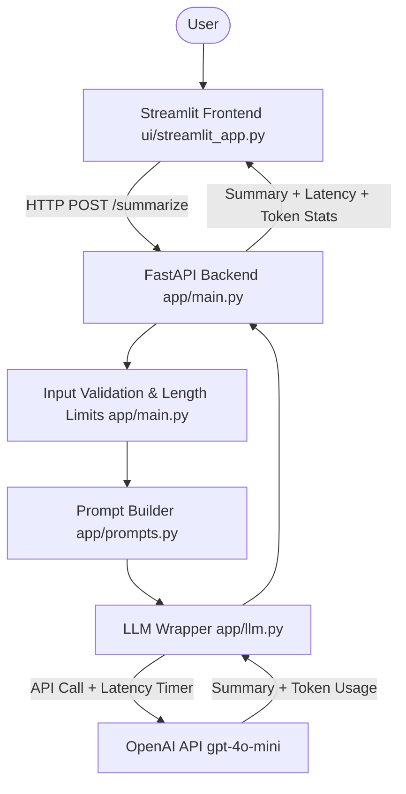

# ⚡ AI Text Summarizer

A production-ready, full-stack AI text summarization application built with **FastAPI**, **Streamlit**, and **OpenAI's LLMs**. Designed to process long-form articles, meeting notes, research papers, and reports into concise, faithful summaries in seconds while providing real-time latency, token usage, and cost analytics.

---

## 🎯 Problem Statement
Users routinely encounter information overload when reading lengthy technical articles, financial statements, and research notes. They require short, faithful, and hallucination-resistant summaries in seconds with explicit control over format (bullet points, narrative paragraph, or executive TL;DR) and length constraints.

---

## 🏗️ Architecture



### Key Architectural Decisions:
1. **Separation of Concerns**: FastAPI backend handles request validation, prompt engineering, and LLM orchestration. The Streamlit UI acts strictly as a presentation layer consuming the REST API.
2. **Provider-Neutral Client**: The LLM client wrapper supports OpenAI (`gpt-4o-mini`, `gpt-4o`) as well as any OpenAI-compatible provider (Groq, Together, Ollama) by configuring base URLs.
3. **Observability & Cost Controls**: Tracks wall-clock latency (ms), prompt tokens, completion tokens, and estimated cost per inference call.
4. **Input Boundary Validation**: Rejects empty, noisy, or excessively short inputs (< 50 chars / < 10 words) and enforces max size bounds (30,000 characters) to prevent cost runaway.

---

## 💻 Tech Stack
- **Backend**: Python 3.11+, FastAPI, Uvicorn, Pydantic v2
- **Frontend**: Streamlit
- **LLM Integration**: OpenAI Python SDK (`gpt-4o-mini` default)
- **Configuration & Secrets**: `python-dotenv`
- **Testing**: `pytest`, `httpx`

---

## 📁 Repository Structure

```text
ai-text-summarizer/
├── README.md               # Project documentation & portfolio guide
├── requirements.txt        # Production & testing dependencies
├── pytest.ini             # Pytest configuration
├── .gitignore              # Git ignore rules (secrets, venvs, caches)
├── .env.example            # Environment variable template
├── .env                    # Local secrets (git-ignored)
├── verify_samples.py       # Batch verification script across 10 sample articles
├── app/
│   ├── __init__.py
│   ├── main.py             # FastAPI entrypoint (/health, /summarize)
│   ├── prompts.py          # Prompt templates, length & style controls
│   └── llm.py              # LLM client with latency & token tracking
├── ui/
│   └── streamlit_app.py    # Streamlit dashboard
├── tests/
│   └── test_summarizer.py  # Unit & integration tests
└── samples/                # 10 realistic evaluation articles
    ├── 01_artificial_intelligence.txt
    ├── 02_climate_change.txt
    ├── 03_quarterly_financial_report.txt
    ├── 04_crispr_gene_editing.txt
    ├── 05_remote_work_productivity.txt
    ├── 06_quantum_computing.txt
    ├── 07_terms_of_service_privacy.txt
    ├── 08_renewable_energy_transition.txt
    ├── 09_history_of_internet.txt
    └── 10_microbiome_gut_health.txt
```

---

## 🚀 Quickstart Guide

### 1. Prerequisites
- Python 3.10+ (tested on Python 3.11)
- OpenAI API Key

### 2. Virtual Environment Setup
```bash
# Clone or navigate to the project directory
cd ai-text-summarizer

# Activate the virtual environment
source ai_portfolio_projects/bin/activate
# (or if creating fresh: python3 -m venv ai_portfolio_projects && source ai_portfolio_projects/bin/activate)

# Install dependencies
pip install -r requirements.txt
```

### 3. Configure Environment Variables
Copy `.env.example` to `.env` and insert your OpenAI API key:
```bash
cp .env.example .env
```
Edit `.env`:
```ini
OPENAI_API_KEY=sk-proj-xxxxxxxxxxxxxxxxxxxx
OPENAI_MODEL=gpt-4o-mini
FASTAPI_HOST=127.0.0.1
FASTAPI_PORT=8000
BACKEND_API_URL=http://127.0.0.1:8000
MOCK_LLM=false
```

> **Note**: If you want to test the entire application locally without incurring API costs or before adding your key, set `MOCK_LLM=true`.

### 4. Run the Backend API
```bash
uvicorn app.main:app --reload --port 8000
```
Interactive Swagger API documentation will be available at: [http://127.0.0.1:8000/docs](http://127.0.0.1:8000/docs).

### 5. Run the Streamlit Frontend
In a separate terminal (with virtual environment active):
```bash
streamlit run ui/streamlit_app.py --server.port 8501
```
Open [http://localhost:8501](http://localhost:8501) in your browser.

---

## 📡 API Reference

### `GET /health`
Returns service availability, model name, and API key configuration status.

**Response (200 OK):**
```json
{
  "status": "healthy",
  "model": "gpt-4o-mini",
  "api_key_configured": true,
  "mock_mode": false,
  "version": "1.0.0"
}
```

### `POST /summarize`
Summarizes input text according to specified style and length constraints.

**Request Body:**
```json
{
  "text": "Over the past decade, artificial intelligence has transitioned from rule-based systems to generative architectures...",
  "format_style": "bullets",
  "length": "medium"
}
```

**Parameters:**
- `text` (*string*, required): Source text (50 - 30,000 characters, minimum 10 words).
- `format_style` (*string*, optional): `"bullets"` (default), `"paragraph"`, or `"tldr"`.
- `length` (*string*, optional): `"short"`, `"medium"` (default), or `"detailed"`.

**Response (200 OK):**
```json
{
  "summary": "- Transformer architecture enabled parallel sequence processing with self-attention.\n- Scaling laws yielded significant leaps in reasoning and coding capabilities.\n- Prompt constraints and RAG mitigate hallucination risks.",
  "format_style": "bullets",
  "length": "medium",
  "model": "gpt-4o-mini",
  "latency_ms": 782.4,
  "prompt_tokens": 312,
  "completion_tokens": 58,
  "total_tokens": 370,
  "estimated_cost_usd": 0.000081,
  "input_char_count": 1495,
  "input_word_count": 180
}
```

---

## 🧪 Testing & Validation

### Run Automated Tests
```bash
pytest tests/
```

### Run Batch Evaluation on 10 Sample Articles
```bash
python verify_samples.py
```

---

## 💼 Interview Explanation & Portfolio Talking Points

### What I Built
> *"I built an AI text summarizer architected as an asynchronous FastAPI backend and an interactive Streamlit UI. The system implements strict prompt constraints to avoid factual hallucinations, input validation boundaries to protect against token exhaustion, and end-to-end token and latency instrumentation to quantify cost-performance trade-offs."*

### Key Design Trade-offs:
1. **Prompt Constraint vs Creativity**: Set low LLM temperature (`0.3`) and strict system prompt guidelines restricting the model strictly to source material facts.
2. **Cost & Latency Optimization**: Defaulted to `gpt-4o-mini` with explicit output token caps (`max_tokens`), yielding sub-second latency and an average inference cost of less than $0.0001 per summary.
3. **Factual Verification**: Validated the summarizer across 10 diverse domain samples (biomedical, legal terms, financial earnings, distributed systems) to verify omission resistance.

